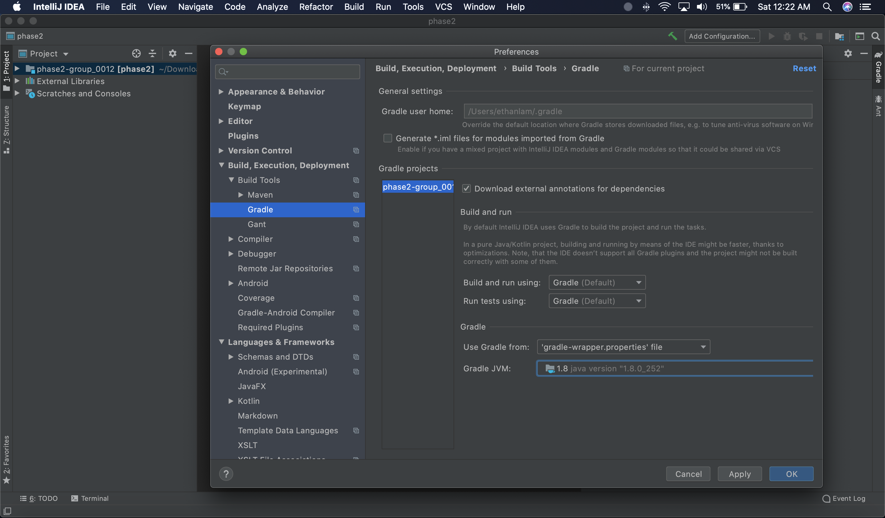

# README

## SETTING UP

To set up the program, first download the Phase2 folder. If you do not have the correct version of gradle installed, you'll run into an error. To resolve this issue, you'll need to go to your IntelliJ settings:

Mac:  `IntelliJ IDEA -> Preferences -> Build, Execution, Deployment -> Build Tools -> Gradle`

 Windows: `Files -> Settings -> Build, Execution, Deployment -> Build Tools -> Gradle`

You should get to this screen:

Click on the box next to `Gradle JVM`, and click `Download JDK`. Select `AdoptOpenJDK (HotSpot)` as the vendor, and version `11.0.8`. The location should set automatically:

Click `Download`, and once IntelliJ has finished downloading files, it should automatically apply the new changes. If not, just restart IntelliJ. From there, click on the gradle tab in the top right, and click on `phase2/Tasks/Application/run`, which will run the program.

